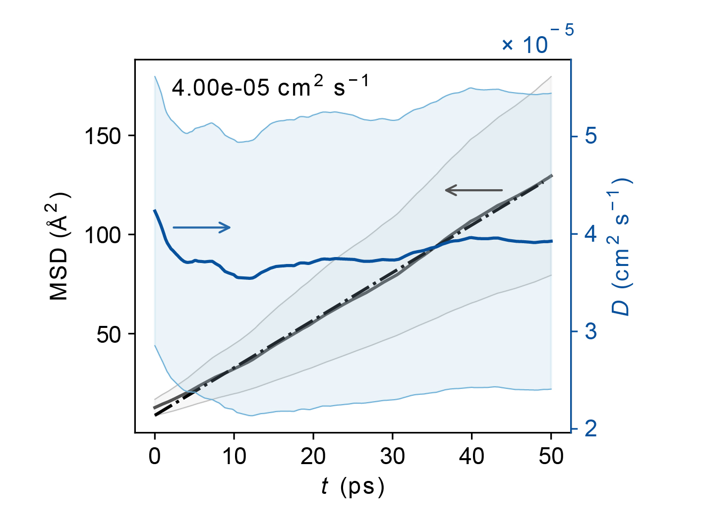
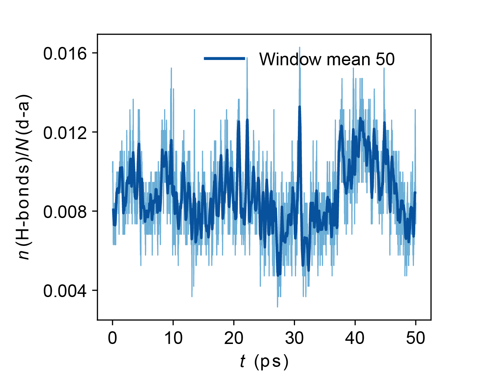
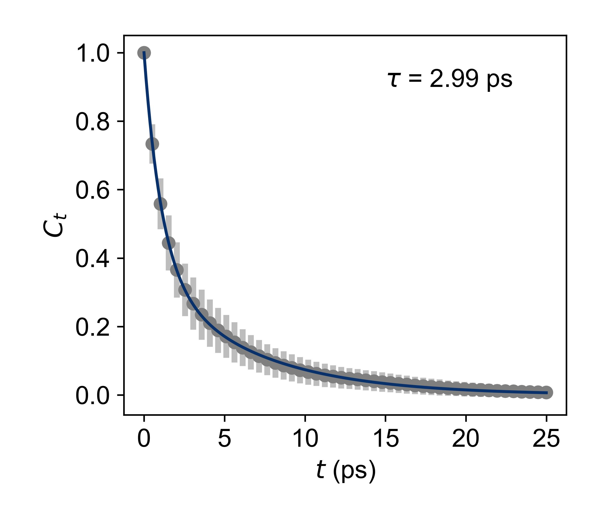

# Molecular-Dynamics-Molecular-Cages
> AIMD data analysis methods and part of the raw data for the paper "**Supramolecular Proton Conductors Self-Assembled by Organic Cages**".

## Methods
The analysis methods are described in the [md_ana.ipynb](https://github.com/Lei-Lei-alpha/Molecular-Dynamics-Molecular-Cages/blob/main/md_ana.ipynb) file.

## Results
The analysis results are available in the [cage1](https://github.com/Lei-Lei-alpha/Molecular-Dynamics-Molecular-Cages/tree/main/cage1) and [cage2](https://github.com/Lei-Lei-alpha/Molecular-Dynamics-Molecular-Cages/tree/main/cage2) folders. The files in the above folders are:
- `sys-pos-1.xyz` the AIMD raw trajectory file generated by [CP2K](https://www.cp2k.org/) code run on [Archer2](https://www.archer2.ac.uk/).
- `cage*_500K.xyz` the trajectory file calibrated by fix the centre of mass of the system.
- `water_com_cage*.xlsx` the centre of masses of water molecules
- `MSD_D_H2O_cage*.xlsx` the mean square displacements and diffusion coefficients of water molecules.
- `hbonds_mic.json` the hydrogen bond analysis results, including the number of H-bonds in each frame, the donor, acceptor, the donor-acceptor separation, the D-H&middot;&middot;&middot;A angle. For cage-2, only 3000 frames are included due to file size limit.
- Figures:
  - `cage*_500K_ave.jpg` Average MSD and diffusion coefficient with error bounds.
  
  
  - `cage*_nhbonds_500K.jpg` Number of Hydrogen bonds per unique hydrogen bonding donor-acceptor pairs with respect to time.
  
  
  - `cage*_hbond_lifetime_500K.jpg` Hydrogen bond lifetime.
  
  

## Raw data
The trajectory was dumped for every 5 fs (every 10 AIMD steps), and the raw `.xyz` trajectory files are large (several hundreds of MB). Part of the raw trajectory data (650 frames, the time interval between two consecutive frames is 5 fs) have been uploaded to the cage1 and cage2 folders. For our analysis, all frames (over 11,000 frames, > 55,000 fs or 55 ps) in the large raw trajectory files were used. The raw trajectory files can be provided in reasonable request to reproduce our results.

## Citation
Please ensure you cite our paper if you used our methods in your research. Our paper was just accepted by JACS Au, we will put the citation information here once it is available.

## Contacts
Please contact [Lei Lei](mailto:Lei.Lei@nottingham.ac.uk) or [Dr Sanliang Ling](mailto:sanliang.ling@nottingham.ac.uk) for further computational details of the simulation results. Any other correspondence regarding the paper should be sent to [Dr Shaodong Zhang](mailto:sdzhang@sjtu.edu.cn).
